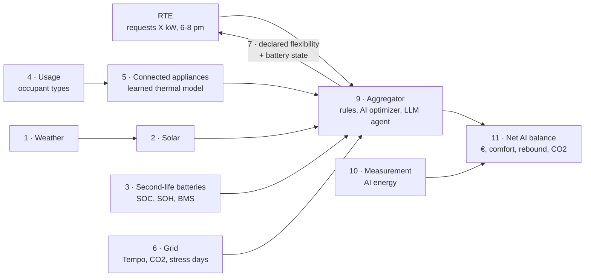

# ⚡🏘️ Quartier Flex

**Demand response in a district: connected appliances, second-life EV batteries, solar.
Does the AI that steers it save more than it consumes?**


🇫🇷 Version française : https://github.com/corinne3/quartier-flex

Team project from the **Aclimakathon 2026** (challenge #5), following on from [Bilan Net](https://github.com/corinne3/bilan-net)
(in French) and [Autoconso IA](https://github.com/corinne3/autoconso-ia) (in French).

## The idea

On very cold days, **RTE** (the French transmission system operator) asks for consumption to be **shed** at peak
hours (6–8 pm). RTE does not control homes: it activates an **aggregator**, which shares out the effort. Here, the
aggregator is an AI that juggles:

- **sheddable groups** = occupant type (family, retirees, students…) × connected appliance
  (heating cut for 30 min max, water heater, delayed EV charging);
- **reused electric-car batteries**, whose state (charge, health) is **reported to RTE**;
- **solar panels** and the **grid** (Tempo tariff: EDF's option where a few dozen "red" winter days have very
  expensive peak hours).

And we **measure the AI's own energy use**, to answer the challenge: *does the AI consume more than it saves?*



## Getting started

```powershell
pip install -e ".[all]"
quartier check                  # checks the installation and data access
quartier demo appliances        # tests ONE module (text + charts in results/)
quartier flex                   # the full assessment (fake LLM agent)
quartier interface              # interface: one page per module
quartier video                  # narrated demo video
```

Step-by-step installation: [docs/00_GETTING_STARTED.md](docs/00_GETTING_STARTED.md) · Architecture document: [docs/ARCHITECTURE.md](docs/ARCHITECTURE.md).

## The modules: test them one by one

| # | Module | Demo | Tests | Doc |
|---|---|---|---|---|
| 1 | Weather | `quartier demo weather` | `pytest tests/test_weather.py` | [doc](docs/modules/01_weather.md) |
| 2 | Solar | `quartier demo solar` | `pytest tests/test_solar.py` | [doc](docs/modules/02_solar.md) |
| 3 | Second-life batteries | `quartier demo batteries` | `pytest tests/test_batteries.py` | [doc](docs/modules/03_batteries.md) |
| 4 | Usage (occupant types) | `quartier demo usage` | `pytest tests/test_usage.py` | [doc](docs/modules/04_usage.md) |
| 5 | **Connected appliances** | `quartier demo appliances` | `pytest tests/test_appliances.py` | [doc](docs/modules/05_appliances.md) |
| 6 | Grid | `quartier demo grid` | `pytest tests/test_grid.py` | [doc](docs/modules/06_grid.md) |
| 7 | **Demand response (RTE)** | `quartier demo demand_response` | `pytest tests/test_demand_response.py` | [doc](docs/modules/07_demand_response.md) |
| 8 | Battery control (self-consumption) | `quartier demo control` | `pytest tests/test_control.py` | [doc](docs/modules/08_control.md) |
| 9 | **Aggregator** | `quartier demo aggregator` | `pytest tests/test_aggregator.py` | [doc](docs/modules/09_aggregator.md) |
| 10 | Measurement | `quartier demo measure` | — | [doc](docs/modules/10_measurement.md) |
| 11 | Assessment | `quartier flex` / `quartier run` / `quartier size` | `pytest tests/test_assessment.py` | [doc](docs/modules/11_assessment.md) |

## What counts as "AI" here

| Where | Technique | Cost measured |
|---|---|---|
| Appliances | system identification (regression): insulation and thermal inertia of each home | yes |
| Demand response | forecast of the district's flexibility (learned model + forecast weather) | yes |
| Aggregator | "shadow homes" + linear optimization (HiGHS) | yes |
| Aggregator | **LLM agent** (Ollama, Qwen 2.5) with a tool, validated output (Pydantic), budget, safe fallback | yes |
| Solar, usage, batteries | gradient boosting, k-means, robust regression | yes |

## Data

| Data | Source | Real or simulated |
|---|---|---|
| Observed and forecast weather | Open-Meteo (archive + archived forecasts) | real |
| CO2 and national consumption | RTE éCO2mix (ODRÉ) | real |
| Stress days (Tempo) | approximated from national consumption | **approximation** |
| Homes, appliances, behavior | typical profiles + physics + randomness | **simulated** (personal data is not public) |
| Batteries | model + aging + noisy sensors | **simulated** |

Offline, everything falls back to synthetic data, **always flagged**.

## Results

Week of 15–21 January 2024, 60 homes, 8 RTE requests. Real weather and grid data, simulated homes.

| | Cut everything | Round-robin | Prepared round-robin (best without AI) | AI optimizer | LLM agent |
|---|---|---|---|---|---|
| Delivered | 58 % | 64 % | 91 % | 89 % | 87 % |
| Rebound | 633 kWh | 488 kWh | 460 kWh | 70 kWh | 61 kWh |
| Added discomfort | +239 °C·h | +102 °C·h | +70 °C·h | −33 °C·h | −37 °C·h |
| Profit | 38 € | 35 € | 279 € | 354 € | 344 € |
| AI compute energy | ~0 | ~0 | ~0 | 0.72 mWh | 238 mWh |
| LLM calls | 0 | 0 | 0 | 0 | 8 |
| Net AI gain vs best rule | | | reference | +74.76 € | +64.30 € |

- **The sober optimizer wins**: +75 €/week, rebound divided by 6.5, no added discomfort, for less than 1 mWh of compute.
- **The LLM agent** (Qwen 2.5 1.5B on a laptop CPU) uses ~330× more energy than the optimizer for a slightly worse
  result (−10 €). It is acceptable only because it is called 8 times a week (strategic level, the day before), never
  every 15 minutes.
- **Prompt language matters**: in the French version of this project, the same agent needed 18 calls (1,242 mWh) for
  the same week — retries after malformed answers. Same model, same task, ~5× the energy (a single run each: an
  observation, not a benchmark).
- **Honest caveat**: the homes are simulated, and the CO2 gain is underestimated (average grid intensity, not
  marginal intensity).

## Stack

Python, pandas, NumPy, scikit-learn, SciPy (HiGHS), Pydantic, Ollama (Qwen 2.5), Streamlit, matplotlib.
100 % CPU, 100 % open source.

## License

MIT.
