# Architecture dossier — Quartier Flex

> **Demand response in a residential district: connected appliances, second-life EV batteries, solar.
> Does the AI in control save more energy than it consumes?**
>
> Aclimakathon 2026 — challenge #5 · Repository: https://github.com/corinne3/quartier-flex-en · MIT License

> 🇫🇷 French version: https://github.com/corinne3/quartier-flex

---

## Table of contents

0. [How to read this document](#0-how-to-read-this-document)
1. [The problem](#1-the-problem)
2. [Requirements and constraints](#2-requirements-and-constraints)
3. [Architecture overview](#3-architecture-overview)
4. [Architecture decisions (ADR)](#4-architecture-decisions-adr)
5. [Data flows and timing](#5-data-flows-and-timing)
6. [The modules, one by one](#6-the-modules-one-by-one)
7. [The core: the aggregator](#7-the-core-the-aggregator)
8. [Generative AI: the LLM agent and its harness](#8-generative-ai-the-llm-agent-and-its-harness)
9. [Measuring the AI's energy](#9-measuring-the-ais-energy)
10. [The assessment: indicators and formulas](#10-the-assessment-indicators-and-formulas)
11. [Results](#11-results)
12. [Quality: tests, reproducibility, data honesty](#12-quality-tests-reproducibility-data-honesty)
13. [Interfaces: CLI, Streamlit, video](#13-interfaces-cli-streamlit-video)
14. [Limitations and risks](#14-limitations-and-risks)
15. [Scaling up: from prototype to product](#15-scaling-up-from-prototype-to-product)
16. [Project history: the bugs that taught something](#16-project-history-the-bugs-that-taught-something)
17. [Interview questions and answers](#17-interview-questions-and-answers)
18. [Glossary](#18-glossary)

---

## 0. How to read this document

- **For a 30-second interview answer**: read the pitch below and §11 (results).
- **To defend the architecture**: §3 (overview) + §4 (justified decisions).
- **For in-depth technical questions**: §7 (linear optimization, "shadow homes"), §8 (agentic harness),
  §9 (energy measurement).
- **To show perspective**: §14 (limitations) and §16 (the bugs and what they taught).

### The 30-second pitch

> "When the power grid is under stress, RTE, the French grid operator, asks aggregators to **shed** demand: switch off
> heaters for a few minutes, postpone EV charging. I built a district simulator — 60 homes, connected appliances,
> second-life EV batteries, solar — and compared several aggregator 'brains': simple rules, an optimizer using learned
> models, and an LLM agent. And I **measured the energy consumed by the AI itself**. The result: the lightweight
> optimizer earns €75 more per week and cuts the rebound by a factor of 6.5, with no loss of comfort, for less than one
> milliwatt-hour of compute. The LLM uses about 330 times more energy for a slightly worse result. The lesson: the right AI
> for flexibility is forecasting and optimization; the LLM belongs at the strategic level only."

### The 2-minute pitch (structure)

1. **The context**: electricity can't be stored at scale; at winter peaks you either produce more (gas-fired plants,
   carbon-intensive and expensive) or consume less → **demand response**.
2. **The challenge question**: digital optimization tools consume energy themselves. Is it worth it?
3. **The approach**: a digital twin of the district, 11 modules that can each be tested on their own, real data (RTE,
   Open-Meteo) where it exists, simulated and clearly flagged where it doesn't.
4. **The result**: lightweight AI wins clearly; generative AI is useful at the right level (one decision the day
   before), costly anywhere else.
5. **The engineering method**: compute-energy measurement, an agentic harness (validation, budget, safe fallback),
   automated tests, CI.

---

## 1. The problem

### 1.1 Why demand response?

- The power grid must be **balanced at every instant**: generation = consumption.
- In France, **electric heating** makes consumption very sensitive to cold weather: roughly **+2,400 MW for every
  degree drop** in winter (an order of magnitude often quoted by RTE).
- **Peaks**: in the morning (7–9 am) and above all in the evening (6–8 pm), on very cold days.
- Two levers to get through the peak:
  - **produce more**: peaking plants (gas, oil), imports → expensive and carbon-intensive;
  - **consume less at the right time**: **demand response** (switching off or shifting usage).

### 1.2 How it works in France (be ready to explain it)

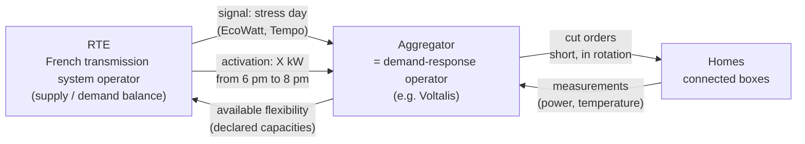

- **RTE** is the French **transmission system operator** (TSO): it runs the high-voltage grid and keeps supply and
  demand balanced nationwide.
- **RTE never controls a home directly.** It contracts with **demand-response operators** (aggregators) that commit to
  **volumes** (kW) and are **activated** on given time slots.
- Existing mechanisms (worth naming without going into the legal details): the **balancing mechanism**, **NEBEF**
  (notification of demand-response block exchanges, which lets shed energy be sold on the wholesale market),
  **demand-response tenders**, and, for households, the **EcoWatt** signal (RTE's public "grid weather" alert, from green
  to red, asking people to cut usage on stressed days) and the **Tempo** tariff (an EDF tariff with mostly cheap "blue"
  days, some "white" days and 22 very expensive "red" winter days announced the day before).
- The aggregator is **paid** for the energy shed, and **penalized** if it doesn't meet its commitments.
- Real-world example: Voltalis switches off electric heaters **for a few minutes, in rotation**, in hundreds of
  thousands of homes. Each cut goes unnoticed; together they add up to hundreds of MW.

### 1.3 The challenge #5 question

> "Make sure that power-system optimization solutions don't consume more than they help save."

Turned into a measurable question:

$$\text{net AI gain} = \underbrace{\text{profit with AI} - \text{profit of the best solution without AI}}_{\text{gross gain}} - \underbrace{\text{cost of the energy consumed by the AI}}_{\text{measured}}$$

- **Key methodological point**: the AI is compared with the **best** solution **without AI**, not with "doing nothing".
  Otherwise you credit the AI with gains a simple rule would have achieved.
- We also count what money doesn't capture: **comfort**, **rebound**, **CO2**.

### 1.4 The team's requirements (and how they were translated)

| Team request | Technical translation |
|---|---|
| The same question: AI consumption vs savings | **measurement** module + net balance (§9, §10) |
| Reused EV batteries: measure charge and state, take them into account | **batteries** module (model + BMS + learned SOH); SOH → wear cost and max power; state **reported to RTE** |
| Scale: home → building → district | `n_homes` parameter; demand response is reasoned at **district** level |
| Solar panels, AI forecast from weather + measurements, variable sizing | **solar** module (physics + simulated meter + gradient boosting), kWp × packs sweep |
| Grid with tariffs | **grid** module (Base, peak/off-peak, Tempo, feed-in) |
| Occupants: measure usage, learn | **usage** module (profiles, k-means, forecast) |
| **Demand response requested by the grid** | **demand response** module (RTE requests) + **aggregator** |
| Types of connected appliances (heating 30 min…) | **appliances** module (1R1C heating, water heater, EV; non-sheddable loads) |
| Demand response at home or district level? | **district** (via the aggregator); occupant × appliance = **sheddable groups** (§1.5) |
| Report battery status to RTE | **declared flexibility** report (SOC, SOH, capacity, power) (§6.7) |
| Test module by module, understand | 11 modules, each with a demo + tests + a documentation sheet + an interface page |

### 1.5 The structuring question: demand response at home or district level?

This is **the** architecture question raised by the team. A reasoned answer:

- **Regulatory reality**: RTE deals with aggregators, not with households.
- **Statistical reality: diversity (aggregation smoothing).** A single home is unpredictable (people come back earlier,
  they're away…). Measured in the project: the heating forecast error at 6–8 pm is **21% for one home** and **12% for
  the district**. Individual errors cancel out when aggregated.
- **Power reality**: a heater draws 1 to 2 kW. RTE thinks in MW. Only aggregation makes sense.
- **Architectural consequence**: three levels, with an **intermediate level** that carries the intelligence.

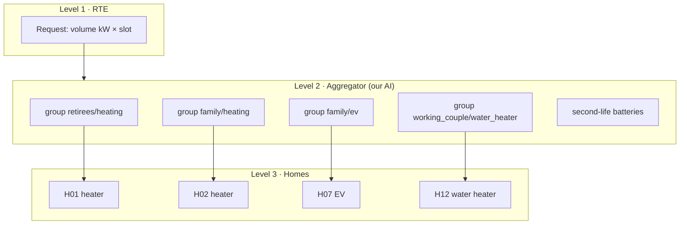

- **Sheddable group = (occupant type, appliance)**, for example `retirees/heating`.
  - It's the right granularity to **decide**: members of a group share similar constraints (retirees are home during
    the day and more vulnerable to cold; working people are away and their heating is already turned down).
  - It's the right granularity to **declare**: RTE doesn't need to know each home.
  - The **home** remains the unit of **execution** (a specific heater is switched off) and of **measurement**
    (comfort).
- Short interview answer: *"Demand response is contracted at district level, decided at group level, and executed at
  home level."*

---

## 2. Requirements and constraints

### 2.1 Functional requirements

| ID | Requirement |
|---|---|
| F1 | Simulate a district of N homes (occupant types, appliances) at a 15-min time step |
| F2 | Generate realistic demand-response requests (real stress days, peak slots) |
| F3 | Declare the district's flexibility, **batteries included** |
| F4 | Compare several aggregator strategies, including a "well-designed" one without AI |
| F5 | Measure the compute energy of each strategy, **LLM included** |
| F6 | Compute the net AI gain (€, comfort, rebound, CO2) |
| F7 | Test and understand **each module separately** (demo + tests + documentation sheet) |
| F8 | Graphical interface and demo video |

### 2.2 Non-functional requirements and constraints

| Constraint | Architectural consequence |
|---|---|
| **Laptop without a GPU** (i5-1155G7, 4 cores, 8 GB) | small models (quantized Qwen 2.5 1.5B), lightweight algorithms, NumPy-vectorized simulation |
| **No cloud credits, 100% open source** | local Ollama, scikit-learn, SciPy/HiGHS, Streamlit |
| **Windows** | PowerShell commands, paths, Windows-compatible CPU measurement (psutil) |
| **48-hour hackathon**, mixed team (3 non-developers) | independent modules, readable demos, documentation sheets in French, interface |
| **Deployable elsewhere** (GitHub showcase) | installable Python package (`pip install -e .`), CLI, CI on Linux + Windows |
| **Reproducible** | fixed random seeds, data cache, offline mode |
| **Honest** | all simulated or synthetic data is **flagged**; "fake LLM" results marked as not publishable |
| **No internet available** (venue, CI) | synthetic fallback data, FakeLLM |

### 2.3 What is deliberately out of scope

- The **distribution grid** (voltage constraints, transformers): we reason in aggregated energy.
- The real-time **market** (spot prices, auctions): flat-rate, configurable payment.
- The aggregation **contract** and capacity certification.
- **Real personal data** (individual Linky smart-meter data): not public → simulated.

---

## 3. Architecture overview

### 3.1 Context (C4 "system" level)

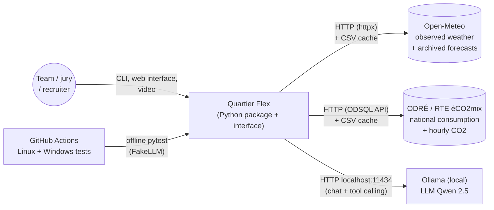

- **Only two external sources**, both **open and key-free**: Open-Meteo and ODRÉ (RTE's open-data platform).
- **The LLM runs locally**: no data sent out, no cost, and above all **its consumption can be measured** (a cloud LLM
  would be an energy black box).

### 3.2 The 11 modules and their dependencies

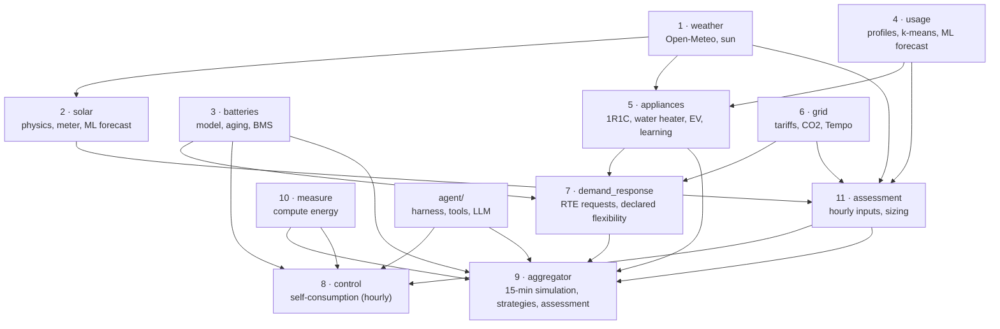

- **Dependency rule**: a module only depends on lower-numbered modules (or on the `agent/` and `measure/` utilities).
  No cycles → each module can be tested on its own, in order.
- Modules 8 and 11 come from the previous project (self-consumption, hour by hour) and remain available: the same
  district can be studied from either the **self-consumption** or the **demand-response** angle.

### 3.3 Code organization

```text
quartier-flex-en/
├── pyproject.toml                 # installable package, dependencies, "quartier" command
├── src/quartierflex/
│   ├── config.py                  # ALL assumptions, commented ("TO BE CHECKED")
│   ├── weather/          sun.py, source.py
│   ├── solar/            physics.py, meter.py, forecast.py
│   ├── batteries/        model.py, bms.py
│   ├── usage/            profiles.py, learning.py
│   ├── appliances/       portfolio.py, physics.py, learning.py
│   ├── grid/             co2.py, tariffs.py
│   ├── demand_response/  signals.py, reporting.py
│   ├── control/          base.py, rules.py, optimizer.py, agent.py, forecasts.py
│   ├── aggregator/       data.py, simulation.py, strategies.py, assessment.py
│   ├── measure/          meter.py
│   ├── assessment/       data.py, simulation.py, kpi.py, bench.py, sizing.py
│   ├── agent/            harness.py, tools.py, llm.py
│   ├── demo.py                    # one demo per module (CLI + interface)
│   ├── video.py                   # automatic demo video
│   └── cli.py                     # "quartier" command
├── app/                           # Streamlit interface: Home + 11 pages
├── tests/                         # pytest: one file per module (35 tests)
├── docs/                          # getting started, module sheets, this document
└── .github/workflows/tests.yml    # CI: Ubuntu + Windows
```

### 3.4 The "module" pattern (repeated 11 times)

Every module follows the same contract; this is what makes "block-by-block testing" possible:

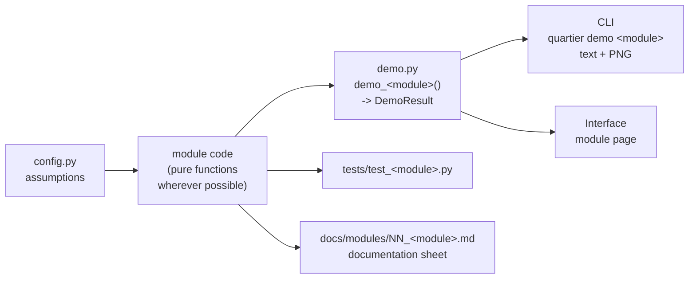

- **`DemoResult`** = summary sentences + matplotlib figures + pandas tables. **A single implementation** serves the CLI,
  the interface and the video → no possible divergence between what the screen shows and what the code computes.

---

## 4. Architecture decisions (ADR)

Format: **context → decision → rejected alternatives → consequences**. This is the most useful part in an interview:
an architect is expected to know **why**, not just **what**.

### ADR-01 · A simulator (digital twin) rather than a system connected to real equipment

- **Context**: no homes, no connected boxes, no individual Linky data (personal data), 48 hours.
- **Decision**: simulate the district with simple physical models, using **real data for everything that is public**
  (weather, national consumption, CO2).
- **Alternatives**: a public dataset of individual consumption (rare, often old, with no identified appliances); sticking
  to a toy example.
- **Consequences**:
  - ✅ we know the **ground truth** (the true temperature, the true curve without demand response) → evaluation can be
    exact, which is impossible in reality (where the "baseline curve" is estimated);
  - ✅ all strategies are compared **on exactly the same district and the same real-life variations**;
  - ⚠️ results depend on the assumptions → they are **all in `config.py`**, commented, marked "TO BE CHECKED".

### ADR-02 · A modular Python package, no heavy framework

- **Context**: mixed team, need to understand and test module by module, modest PC.
- **Decision**: a standard `src/` package (setuptools), modules = sub-packages, functions and small classes,
  NumPy/pandas for computation.
- **Alternatives**: notebooks (hard to test and reuse), a multi-agent simulation framework (Mesa: learning curve,
  slowness), microservices (irrelevant for a prototype).
- **Consequences**: installable with `pip install -e .`, `quartier` command, testable in CI, reusable elsewhere.

### ADR-03 · Two time steps: 1 hour and 15 minutes

- **Context**: public data is hourly; demand response plays out over **30-min** cuts, checked by RTE at a 15- or 30-min
  resolution.
- **Decision**: hourly inputs (weather, RTE, prices), **demand-response simulation at a 15-min step** (linear
  interpolation of weather, step functions for prices).
- **Alternatives**: everything per minute (pointless and slow); everything hourly (impossible to represent a 30-min cut).
- **Consequences**: 672 steps per week × 60 homes, vectorized → **under one second** per strategy.

### ADR-04 · Vectorized "array-based" simulation rather than one object per home

- **Context**: hundreds of homes must be simulated over weeks, several times (once per strategy), on CPU.
- **Decision**: the district state is a set of **NumPy arrays** (one cell per home): `t_in`, `water_heater_kwh`,
  `ev_need`… One simulation step = a few vector operations.
- **Alternatives**: a `Home` class with a `step()` method (readable but ~100× slower in Python).
- **Consequences**: a 60-day history simulated in ~1 s; scaling to 300 homes is painless.

### ADR-05 · A "1R1C" thermal model, learned by system identification

- **Context**: we need to know **how much a home consumes** and **how fast it cools down** when switched off.
- **Decision**: a one-resistance, one-capacitance model (standard in building control); its parameters are **learned**
  by linear regression on the connected box's measurements (§6.5).
- **Alternatives**: a black-box neural network (insufficient data, no physical extrapolation, not explainable); a
  multi-zone model (parameters unavailable).
- **Consequences**: explainable (UA = insulation, C = thermal inertia), extrapolates correctly (to cuts never seen
  before), learns in a few milliseconds → consistent with the challenge question (**lightweight AI**).

### ADR-06 · Linear programming (HiGHS) rather than reinforcement learning

- **Context**: split a request between groups and batteries, under constraints (volume, battery energy, comfort).
- **Decision**: **linear programming** solved by HiGHS (via `scipy.optimize.linprog`), over a rolling horizon.
- **Alternatives**: RL (long training, few guarantees, unstable, resource-hungry); a greedy heuristic alone (can't handle
  trade-offs over time, e.g. spreading battery discharge); MILP (integer variables are unnecessary here: home selection
  happens afterwards, within each group).
- **Consequences**: an **optimal** solution to the stated problem in a few milliseconds, **guaranteed constraints**,
  interpretable costs.

### ADR-07 · The LLM at the strategic level, never at the operational level

- **Context**: in the previous project (self-consumption), an LLM agent consulted **every hour** did as well as the
  simple rule while consuming far more (144 calls for 3 days); consulted **twice a day** and keeping its setpoint, it did
  **worse** (−€4.70).
- **Decision**: the LLM agent decides **only once per request, the day before**, on the optimizer's **settings**
  (protected groups, order, preheating, charging). Execution every 15 min stays with the optimizer.
- **Alternatives**: an LLM at every step (672 calls/week, slow, expensive, unstable); no LLM at all (we couldn't answer
  the question "what about generative AI?").
- **Consequences**: 8 calls for one week instead of hundreds; results close to the optimizer; energy cost measured and
  comparable.

### ADR-08 · A custom agentic harness (rather than an agent framework)

- **Context**: small local models (1.5B) that often get the format wrong; each call needs to be **measured**.
- **Decision**: ~200 lines: agent loop, Pydantic-typed tools, output validation, self-correction, call and token budget,
  safe fallback, traces.
- **Alternatives**: LangChain/LangGraph, CrewAI (heavy abstractions, dependencies, hard to instrument energy at the
  right place, less controlled behavior with a small model).
- **Consequences**: every guardrail is **visible and tested**; two real small-model bugs were fixed in the harness (§16).

### ADR-09 · Measuring energy as CPU time × TDP, cross-checked by three methods

- **Context**: no power meter, Windows, and the LLM runs in **another process** (Ollama).
- **Decision**: CPU time of our process + whole-machine CPU time (minus calibrated background noise) + compute durations
  reported by Ollama; converted using the processor's TDP (§9).
- **Alternatives**: CodeCarbon alone (same principle, less control, doesn't always see the Ollama process); RAPL
  counters (not accessible on Windows); per-token estimates from the literature (not measured).
- **Consequences**: a reliable order of magnitude, comparable across strategies (same method for all); limitations
  documented.

### ADR-10 · Real data where it exists, synthetic fallback always flagged

- **Context**: unreliable internet at the hackathon, CI without network access.
- **Decision**: download → **CSV cache** → otherwise **synthetic data** with a source labeled
  "SYNTHETIC (fallback, do not publish)". Results always display their sources.
- **Consequences**: everything runs everywhere; a demo result can never be mistaken for a publishable one.

### ADR-11 · A single source of truth for demos (CLI, interface, video)

- **Decision**: `demo.py` produces a `DemoResult`; the CLI prints it, Streamlit displays it, `video.py` turns it into
  images.
- **Consequence**: what is shown to the jury is exactly what is computed and tested.

### ADR-12 · Streamlit for the interface

- **Context**: an interface was needed within a few hours, in Python, built by people who aren't front-end specialists.
- **Decision**: multipage Streamlit (one page per module), shared scenario in `st.session_state`.
- **Alternatives**: Dash (more verbose), React + API (too long), Gradio (geared toward model demos).
- **Consequences**: interface in ~500 lines; its limitations (no real time, one user at a time) are acceptable for a
  prototype.

### ADR-13 · Fair comparison: same request, same comfort rule, same measurement for all

- **Decision**:
  - the **RTE request** is computed once (from the trajectory without demand response) and is **identical** for all
    strategies;
  - the **comfort rule** (30 min max cut, then 30 min rest) is enforced **by the simulator**, not by the strategies →
    none of them can cheat;
  - all strategies go through the **same energy meter**.
- **Consequence**: differences in results come **only** from the intelligence of the strategies.

---

## 5. Data flows and timing

### 5.1 The preparation pipeline (once per scenario)

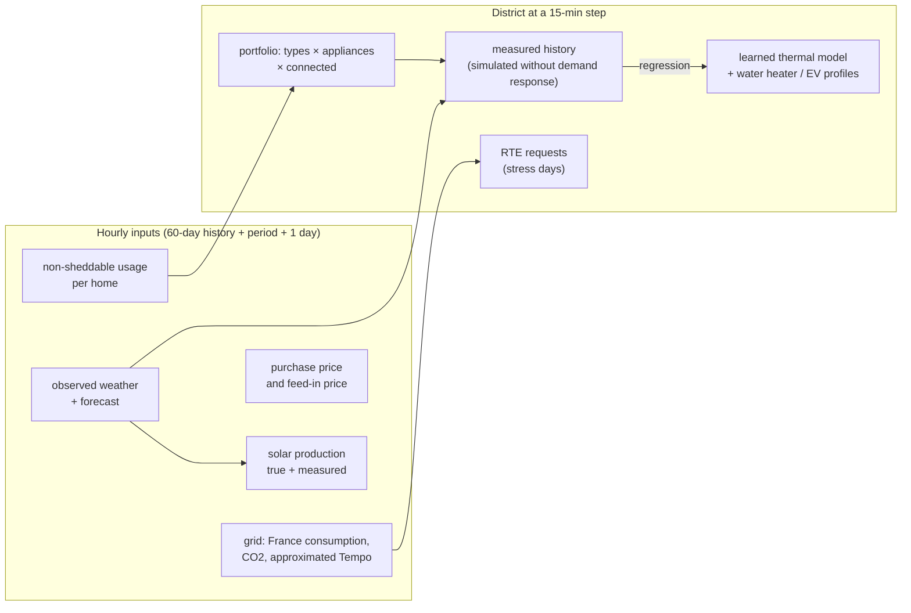

- `load_district(scenario)` (in `aggregator/data.py`) does all of this and returns an immutable
  **`DistrictContext`**, shared by all strategies.
- The compute cost of learning is **measured** at this point and charged to the strategies that use it.

### 5.2 Timeline of a demand-response request

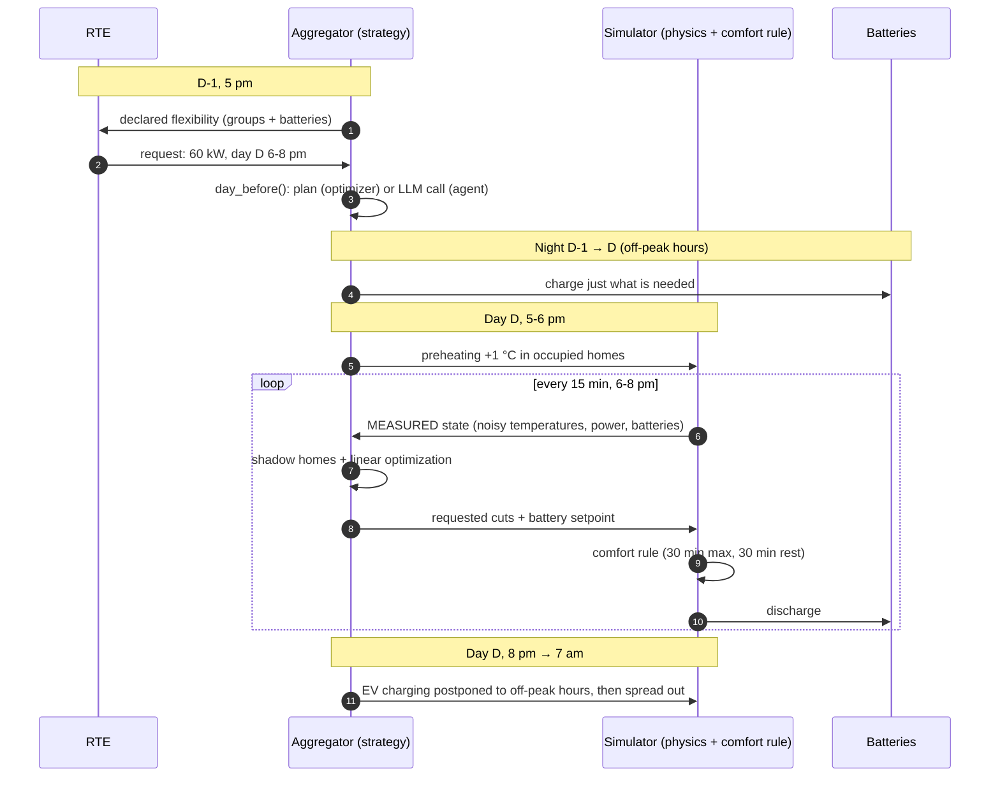

### 5.3 Why the history is "simulated without demand response"

- In reality, the aggregator has the boxes' **past measurements**.
- We produce them by simulating the 60 days before the period **with no cuts at all**: that's what a box installed two
  months earlier would have measured.
- Subtle point: the history uses **real life** (schedules that vary every day), but learning only knows the thermostat's
  **schedule**. So the AI learns with "behavioral noise", just like in reality.

### 5.4 Ground truth vs available information (strict separation)

| Quantity | What the simulator knows (truth) | What the strategy sees |
|---|---|---|
| Indoor temperature | exact | measurement + noise (σ = 0.1 °C) |
| Insulation UA, inertia C | exact | **learned** (±11% on C) |
| Occupancy schedules | schedule + the day's real-life variations | schedule only (for forecasting); current thermostat setpoint |
| Power demanded by each appliance | exact | same (the box measures it) |
| EV charging need | exact | same (controllable charging point) |
| Consumption without demand response | exact | **unknown** → estimated (shadow homes) |
| Weather | observed | forecast (Open-Meteo, archived forecasts) |

This is what makes the comparison credible: **the AI has no access to the answers**.

---

## 6. The modules, one by one

For each module: **role**, **how**, **why this choice**, **takeaways**, **limitations**.

### 6.1 Module 1 — Weather (`weather/`)

- **Role**: **observed** weather (reality) and weather **forecast the day before** (what was known at decision time).
- **Sources**:
  - observed: `archive-api.open-meteo.com/v1/archive` (reanalysis);
  - forecast: `historical-forecast-api.open-meteo.com/v1/forecast` (**archived forecasts**: what a real weather model
    was predicting at the time).
- **Variables**: temperature, global horizontal irradiance (GHI), direct normal (DNI), diffuse (DHI), cloud cover.
- **Details that matter**:
  - Open-Meteo gives the average over the **previous** hour: the index is **shifted by one hour** to represent the start
    of the hour (otherwise the sun "rises" one hour too late in the calculations);
  - conversion **UTC → Europe/Paris**, time-zone-aware index (daylight saving changes handled).
- **Sun position** (`sun.py`): **NOAA** formulas (accuracy ~0.01°), plus a clear-sky model.
- **Why the archived forecast?** Using observed weather to make decisions would be **cheating** (knowing the future).
  It is a classic mistake in energy optimization studies.
- **Fallback**: synthetic weather (clear-sky curve × random cloud cover), forecast = observed + error.

### 6.2 Module 2 — Solar (`solar/`)

- **Physics** (`physics.py`):
  1. sun position → angle of incidence on the panel (30° tilt, facing due south);
  2. if direct irradiance is not provided: **Erbs** decomposition (global → direct + diffuse);
  3. irradiance **in the plane of the panel** (**isotropic** model: projected direct + sky diffuse + ground reflection,
     albedo 0.2);
  4. cell temperature (**NOCT** model) → efficiency loss (−0.4 %/°C above 25 °C);
  5. × peak power (kWp) × **performance ratio** 0.86 (inverter, cables…).
- **Simulated meter** (`meter.py`): ±2 % noise, **soiling** that builds up and is washed off by rain, short inverter
  **outages**. This is what an AI can learn and physics ignores.
- **Forecast** (`forecast.py`): three methods, from cheapest to most expensive:
  - persistence ("tomorrow = today");
  - physics applied to the **forecast** weather;
  - **gradient boosting** (`HistGradientBoostingRegressor`) that learns the relation forecast weather → **measured**
    production, using as features the physics itself, the hour, the season, irradiance and temperature.
- **Key choice**: the model learns production **per kWp** → it works whatever the size of the installation
  (sizing without retraining).
- **Takeaways**: persistence fails when the weather changes; physics and ML are close, ML corrects the biases
  (soiling) but slightly underestimates the peaks.

### 6.3 Module 3 — Second-life batteries (`batteries/`)

- **Model** (`model.py`) — one **pack**:
  - current capacity = new capacity × **SOH** (state of health);
  - SOC (state of charge) bounded between 10 % and 90 % (preserves the battery);
  - 95 % efficiency on charge and on discharge (round trip ≈ 90 %);
  - **reduced power when worn**: `p_max × min(1, SOH / 0.8)`;
  - **aging**: per cycle (0.012 % of SOH per equivalent full cycle) + calendar (1.5 %/year, higher when the SOC is
    high).
- **Bank**: several packs with different SOH, controlled as a single battery; the setpoint is split **in proportion to
  each pack's margins** (a nearly full pack charges less).
- **BMS** (`bms.py`) — **measuring what cannot be measured**:
  1. energy **counting** (coulomb counting): a sensor with +2 % gain error and +30 Wh/h offset **drifts**;
  2. **recalibration from the rest voltage** (OCV curve of an NMC cell): the principle of a simplified Kalman filter;
  3. **learned SOH**: between two rest periods, capacity = energy exchanged / SOC change; a **robust Huber
     regression** on these noisy points gives the SOH and its **trend** → end-of-second-life date (SOH 60 %).
- **Demo results** (1 year, 40 kWh pack at 75 %): SOC error of **14.3 points** with counting alone versus **1.7**
  with the voltage; learned SOH 72.6 % for an actual 71.1 %; end of second life estimated at ~3 years.
- **How battery state feeds into decisions**:
  - **wear cost** = pack price / (2 × cycles left before 60 %) → a worn battery "costs more" to use, so the
    optimizer spares it;
  - reduced **max power** → fewer kW that can be declared;
  - **reporting to RTE**: SOC, SOH, actual capacity, power (§6.7).
- **Why Huber?** The capacity estimates contain outliers (small SOC changes → unstable divisions). Least squares would
  be pulled by these points; Huber gives them less weight.
- **Known limitation**: the sensor bias (+2 %) ends up in the learned SOH (~+1.5 points) — a systematic bias is not
  corrected by more data, it needs a **reference** (calibration).

### 6.4 Module 4 — Usage (`usage/`)

- **Profiles** (`profiles.py`): 5 household types (family, working couple, retirees, remote worker, student), each =
  baseline consumption + "bumps" (hour, width, power) on weekdays and at weekends, seasonality, busier or quieter days,
  absences, washing machines. Calibrated on an annual consumption per type (TO BE CHECKED, ADEME/Enedis).
- **These are the non-sheddable uses** (lighting, cooking, refrigeration, multimedia); heating, water heater and car are
  modeled physically in module 5.
- **Engineering detail**: types are drawn **before** consumption, with a separate random generator → a home keeps the
  same type whatever the simulated duration (consistency across interface pages). *Real bug found and fixed.*
- **Learning** (`learning.py`):
  - **habits**: normalized daily curves (shape, not volume) → **k-means** → each home is assigned the majority cluster
    of its days; evaluated with the **ARI** (adjusted Rand index) = 0.65 without knowing the types;
  - consumption **forecast** (gradient boosting, features: hour, day, season, D-1, D-7, 7-day average, forecast
    temperature): nMAE **12 %** versus 18 % (D-1) and 14 % (D-7).
- **Privacy**: these computations can run **locally**; only aggregated data leaves the district.

### 6.5 Module 5 — Connected appliances (`appliances/`) ★

**Who has what** (`portfolio.py`)

| Parameter | Default | Comment |
|---|---|---|
| electric heating | 55 % | TO BE CHECKED (CEREN) |
| electric water heater | 65 % (70 % of them on off-peak control) | the real-world "10 pm peak" comes from this |
| electric car | 25 % (except students) | 7 kW charging, ~9 kWh/day |
| connected box (smart controller) | 80 % | otherwise not controllable |
| floor area | 25 to 85 m² depending on type, ±25 % | |
| insulation | 1.2 W/°C/m² × log-normal factor | some homes are energy sieves |

**The appliances and their flexibility**

| Appliance | Sheddable? | Constraint | Model |
|---|---|---|---|
| heating | 30 min max, then 30 min on | T ≥ setpoint − 1 °C (retirees − 0.5 °C) | 1R1C + thermostat |
| water heater | 2 h max | hot water available | energy store + draws |
| car | unlimited shift | charged at departure (7 am) | kWh need + charging point |
| lighting, cooking, refrigeration… | **no** | low power, comfort, food safety | profiles from module 4 |

**The 1R1C thermal model**

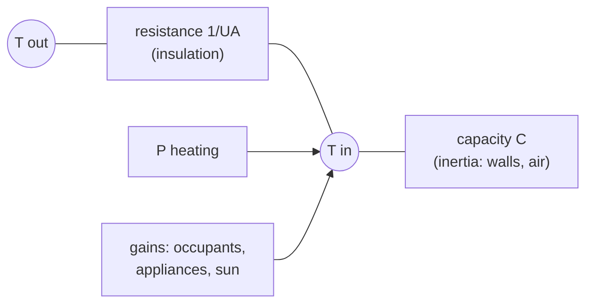

$$T_{k+1} = T_k + \frac{\Delta t}{C}\Big(P_k + A_k - UA\,(T_k - T_{ext,k})\Big)$$

- **C** (kWh/°C): energy needed to raise the home by 1 °C; **UA** (kW/°C): losses per degree of difference;
  **A**: free gains (0.15 kW + 0.25 kW when occupied + sun through the windows).
- **Time constant** τ = C / UA ≈ **15 to 40 hours**: a home cut for 30 min loses a few tenths of a degree.

**The thermostat** (proportional control)

$$P = \mathrm{clip}\Big(UA\,(T - T_{ext}) - A + \frac{C\,(T_{setpoint} - T)}{\tau_{reg}},\; 0,\; P_{max}\Big), \quad \tau_{reg} = 1.5\ \text{h}$$

- It compensates for losses and **gradually catches up** the gap (1 °C in ~1 h 30).
- **Why not a thermostat that goes "straight to the setpoint"?** That was the first version: a heater that had been cut
  caught up **all** the energy in the next quarter-hour → demand response became almost zero. A real thermostat is
  gradual. *Documented model change (§16).*

**Real life**: each day, each household shifts its schedule by ±1 h (probabilities 20/60/20 %) and is sometimes away
(4 % of days). The aggregator only knows the **schedule** → realistic individual forecast error.

**The AI: system identification** (`learning.py`)

The model is **linear in its parameters**:

$$\frac{\Delta T}{\Delta t} = \underbrace{\tfrac{UA}{C}}_{a}(T_{ext} - T) + \underbrace{\tfrac{1}{C}}_{b}P + c + d\cdot\text{presence} + e\cdot\text{sunshine}$$

- **Least-squares** regression, home by home, on 60 days of measurements (noisy temperature, smoothed over 3 steps)
  → `C = 1/b`, `UA = a·C`.
- **No need to cut in order to learn**: setpoint changes (night, absence, return) are enough to "excite" the system.
- **Forecast**: each home is **simulated** with its learned model and the forecast weather (rather than computing a
  "holding power") → this captures the **restarts** (after the night, after work) that cause the 7 am and 6 pm peaks.
  First version based on "holding power": 40 % error; by simulation: **9 %**.
- **Results** (real data from January 2024): inertia learned within **±11 %** (median); heating forecast for 6-8 pm,
  one week ahead: **21 % per home, 12 % for the district** → the measured **diversity effect**.

**The heater experiment** (demo): cut for 30 min at 6 pm → **−0.66 °C**, **2.36 kWh shed** then **2.08 kWh caught up**
(88 %). **Energy is mostly shifted, not removed**: this is the most important sentence of the project, it explains why
naive demand response creates rebounds.

### 6.6 Module 6 — Grid (`grid/`)

- **RTE éCO2mix** via the ODRÉ API (`eco2mix-national-cons-def`, ODSQL queries with `date'YYYY-MM-DD'` literals):
  national consumption and **average CO2 intensity** hour by hour.
- **Tariffs** (incl. taxes, excluding subscription, TO BE CHECKED): Base €0.20; Peak/Off-peak €0.21/0.17; **Tempo**
  blue 0.13/0.16, white 0.15/0.18, **red €0.15/0.66**; surplus resale (feed-in) €0.04/kWh.
- **Approximated Tempo**: the actual color is published by RTE; lacking a simple API, it is approximated from the day's
  national consumption (average > 64 GW → white; > 72 GW on a weekday → red). Over January 2024: 4 white, 3 red.
- **Why Tempo?** It is the tariff that makes the value of flexibility visible: a red peak hour costs **4 times** an
  off-peak hour.

### 6.7 Module 7 — Demand response: RTE requests and reporting (`demand_response/`) ★

**The requests** (`signals.py`)

- **Stress day** = a **weekday** with Tempo color white or red.
- **Slots**: 6 pm - 8 pm on every stress day; **+ 7 am - 9 am on red days** (morning peak).
- **Announcement**: the day before at 5 pm (like the Tempo/EcoWatt signals, published the day before).
- **Demo robustness**: no stress day over the period → a "FORCED" request on the busiest working day, **flagged**.
- Over the week of January 15-19, 2024: **8 requests** (5 evenings, 3 mornings).

**Reporting: what the district declares to RTE** (`reporting.py`)

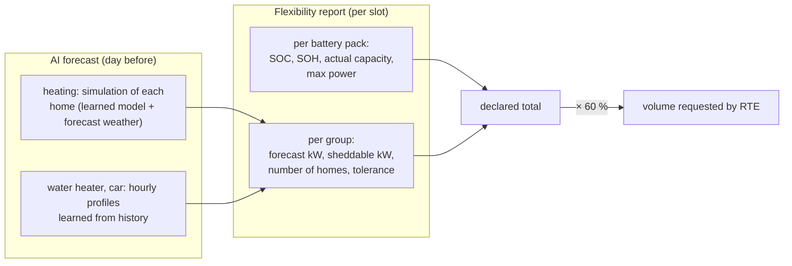

- **Sheddable kW**:
  - heating: **half** of the forecast power (rotation 30 min cut / 30 min on → at best half of the heaters cut at the
    same time);
  - water heater, car: all of it.
- **Batteries**: available energy = Σ actual capacity × (SOC max − SOC min) × efficiency; kW sustainable over the slot =
  min(max power of the bank, energy / duration). This is the **battery state reported to RTE** requested by the team.
- **Requested volume** = 60 % of the declared total (parameter `share_of_flex`). Real example: declared 77 to 110 kW
  (including 26 kW from batteries) → requested 46 to 66 kW.
- **Fairness**: the declaration is made once, from the trajectory **without demand response**, and the **same request**
  applies to all strategies.

### 6.8 Module 8 — Battery control for self-consumption (`control/`, previous project)

Hour by hour, who decides when to charge/discharge the battery to **consume one's own solar** and buy at the right time:

| Strategy | Idea |
|---|---|
| no battery | baseline |
| self-consumption rule | stores the surplus, returns it when there is a shortfall |
| tariff rule | charges at night in off-peak hours if tomorrow's sun will not be enough |
| **optimizer + AI forecasts** | optimal 24 h plan (linear programming), ML forecasts, wear cost |
| LLM agents | every hour, or routed twice a day |

**The optimizer formulation** (horizon H = 24 h, variables per hour: purchase g, resale e, charge c, discharge d,
stored energy E):

$$\min \sum_{t} (1 - 0.002\,t)\,\big(p^{buy}_t g_t - p^{sell}_t e_t\big) + w\,(c_t + d_t) \;-\; v_{end}\,E_H$$

$$\text{s.t.}\quad PV_t - L_t + g_t - e_t - c_t + d_t = 0,\qquad E_{t} = E_{t-1} + \eta_c c_t - d_t/\eta_d,\qquad E_{min} \le E_t \le E_{max}$$

- **w = wear cost** = pack price / (2 × cycles left before SOH 60 %): this is how the **state of health** enters the
  decision.
- **(1 − 0.002 t)**: a slight preference for the present. Without it, when several hours have the same price, the
  solver postpones discharging "until later"… at every replanning: it never discharges. *Real bug: the "procrastination"
  of the receding horizon (§16).*
- **v_end** = value of the energy left at the end of the horizon = minimum price × efficiency − wear. Too high, the
  battery never empties; zero, it empties pointlessly before midnight.
- The power bounds are the bank's **nominal powers**, not the current margin (an empty battery cannot discharge *now*
  but will be able to *after* charging). *Another real bug.*
- **Model predictive control**: only the first hour is applied, and the process restarts the next hour.

**Results (12 homes, 30 kWp, 2 packs)**: in May, bill + wear: €39.77 without battery → €5.31 with the optimizer; in
January on Tempo: €236 → €147 (tariff rule) / €149 (optimizer, with **30 % less wear**). The LLM agents: ≈ the rule
while using 144 calls (hourly), and −€4.70 when the setpoint is held for 15 h (routed).
→ Lesson carried over into ADR-07.

### 6.9 Module 9 — Aggregator: see §7.

### 6.10 Module 10 — Measurement: see §9.

### 6.11 Module 11 — Assessment (`assessment/`)

- Assembles the hourly inputs (`load_inputs`): window [start − 60 d; start + duration + 1 d[; the history is used for
  training, the extra day lets the optimizers look 24 h ahead up to the last hour.
- **Sizing**: sweep over kWp × number of packs, CAPEX (€1,500/kWp, €90/kWh second-life, TO BE CHECKED),
  self-sufficiency rate, payback time, avoided CO2, extrapolated to the year (with the warning to redo it in summer and
  in winter).

---

## 7. The core: the aggregator

### 7.1 The simulation loop (`aggregator/simulation.py`)

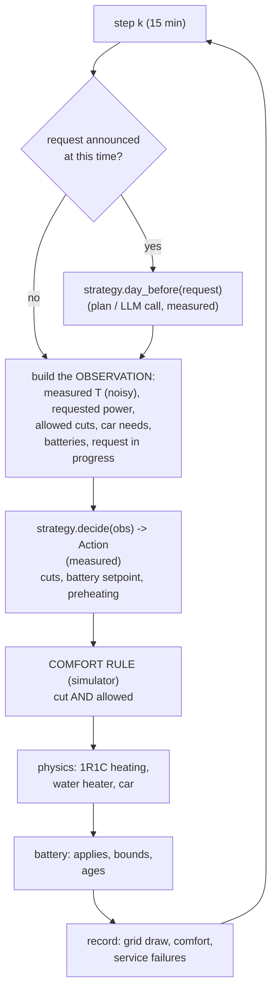

- **The comfort rule is enforced by the simulator**: a strategy may *ask* to cut a heater that has already been cut
  for 30 min, it will not be obeyed. Per-appliance counters: consecutive steps cut / not cut.
- **Default battery behavior** (if the strategy says nothing): self-consumption (stores the surplus, covers the
  shortfall).
- **No discharging for resale**: a discharge is capped at the district's need.
- **Delivered demand response** is measured **after the fact**: grid draw of the "none" simulation − grid draw of the
  strategy.

### 7.2 The five strategies

| # | Strategy | AI | Preparation the day before | During the request | After |
|---|---|---|---|---|---|
| 1 | Cut everything | no | — | cuts everything allowed, battery at full power | — |
| 2 | Round-robin | no | — | battery at full power, cars, water heaters, then heaters in turn until the volume is reached | — |
| 2b | Prepared round-robin | no | **full** charge at night, battery kept | same + battery **spread** over the duration + **30 % margin** | — |
| 3 | **AI optimizer** | light | charges **just what is needed**, **preheating** 1 h before | **shadow homes** + **linear optimization** | cars postponed to off-peak hours then **spread out** |
| 4 | LLM agent | heavy | the LLM **chooses the optimizer's settings** | optimizer | optimizer |

- **Why a "prepared round-robin"?** To be honest: without it, the AI would be compared with naive rules and would claim
  gains that a bit of common sense achieves (charging the battery at night). It is **the best strategy without AI**,
  and the reference for the net balance.

### 7.3 Shadow homes (the key idea of the optimizer)

**The problem**: when a heater is switched back on after 30 min, it consumes **more** than if it had never been cut
(catch-up). A strategy that only looks at "what I am cutting now" underestimates this catch-up and misses the volume
(the simple round-robin only delivers 64 %).

**The solution**: for each home, the optimizer runs a **shadow** **in parallel**: the same home, simulated with the
**learned model**, **never cut**, under the same setpoint and the same weather.

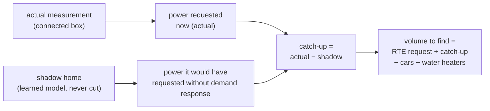

- Initialized at the first step of the request from the **measured** temperature; a bias is **calibrated** at the first
  step (the learned model is not perfect: its constant offset is corrected).
- **Cars**: same idea, simpler. A car's shadow charges at 7 kW as soon as it arrives; a car that *would already have
  finished* does not count as shed if it is cut.
- **Why it is elegant**: this is exactly the **baseline curve** problem of real aggregators ("what would this customer
  have consumed without demand response?"), solved with the learned physical model.

### 7.4 Linear optimization during the request

At each step of the request, over the remaining steps t = 0…H−1:

- **Variables**: x_{g,t} ≥ 0 (kW shed in heating group g), b_t (battery kW), s_t ≥ 0 (shortfall).
- **Objective**:

$$\min \sum_{t}\Big(\sum_{g} c_g\,x_{g,t} + 0.01\,b_t + 0.30\,s_t\Big)$$

- **Constraints**:

$$\sum_{g} x_{g,t} + b_t + s_t \ge V' \quad \forall t,\qquad \sum_t b_t\,\Delta t \le E_{bat},\qquad 0 \le x_{g,t} \le \text{cap}_{g,t},\qquad 0 \le b_t \le P_{bat}$$

- **V′** = requested volume + catch-up (shadows) − what cars and water heaters already shed (cut first: almost zero
  cost, no discomfort).
- **cap_{g,t}**: at the current step, the actual power of the group's **allowed** heaters; afterwards, **half** of the
  forecast (30/30 rotation).
- **Discomfort cost of a group**: c_g = 0.02 + 0.25 × risk_g (+ 0.01 × rank if the LLM agent has set an order), with

$$\text{risk}_i = \mathrm{clip}\Big(\frac{\text{forecast drop in 15 min}}{\max(\text{comfort margin}, 0.05)}, 0, 5\Big)\ \text{if present, 0 otherwise}$$

  - comfort margin = measured T − (setpoint − tolerance);
  - **absent → risk 0**: those who are not at home are cut first;
  - **retirees**: tolerance 0.5 °C instead of 1 → smaller margin → higher risk → **protected** without any special
    rule, simply through the interplay of costs.
- **Penalty of €0.30/kWh** of shortfall ≈ RTE penalty: the optimizer prefers a little discomfort to a shortfall… but
  not much.
- **Battery €0.01/kWh**: cheaper than cutting a heater → the battery goes first, but its **energy is limited**: the
  solver **spreads** it over the whole request (which a "full power" rule does not do).
- **Execution within the group**: homes with **the most margin** (or absent) are cut first, until x_{g,0} is reached.
- **Size**: ~5 groups × 8 steps + 16 variables ≈ 60 variables → a few milliseconds (HiGHS).
- **Fallback**: if the solver fails, the round-robin is applied (never a crash).

### 7.5 Preparing and finishing cleanly

- **Night charging "just what is needed"**: target = SOC min + energy needed for the request. Filling to 100 % would
  prevent storing the midday sun, which would then be sold at €0.04 (measured cost: −€6 on the bill for the rule that
  fills up completely).
- **Preheating**: +1 °C, 1 h before, for homes **scheduled** to be occupied (schedule, not real life). Cost: a small
  consumption bump at 5 pm (accepted limitation). Tested at 0, 0.5 and 1 °C → 1 °C gives the best profit and the best
  comfort.
- **Soft restart**: after a request, car charging is **postponed to off-peak hours** (10 pm), then **spread over the
  night** (power budget = 1.3 × remaining need / hours before 7 am), otherwise they all start at 10 pm: a new peak.

### 7.6 Why the optimizer wins (one sentence per mechanism)

| Mechanism | Measured effect |
|---|---|
| shadow homes | holds the volume despite the catch-up (89 % delivered) |
| discomfort costs based on margin | no added cold (−33 °C·h instead of +70) |
| spread battery + adjusted charging | less wear (€3.51 versus €5.84) |
| soft restart of cars | rebound ÷ 6.5 (70 kWh versus 460) and charging in off-peak hours |
| preheating | comfort, and more margin for cutting |

---

## 8. Generative AI: the LLM agent and its harness

### 8.1 What the agent does

- **When**: once per request, at the announcement (the day before at 5 pm).
- **What it sees**: a short JSON message (volume, start, end) + a **tool** `view_flexibility` that returns the
  flexibility report (groups, kW, tolerances, battery state).
- **What it decides** (**validated** output):

```json
{"order": ["family/ev", "family/water_heater", "working_couple/heating"],
 "exclude": ["retirees/heating"],
 "preheat": true,
 "precharge_battery": true,
 "reason": "comfort first"}
```

- **What it changes**: these choices become the optimizer's **settings** (excluded groups → capacity 0; order → small
  extra cost per rank; preheating yes/no; charging yes/no). The optimizer executes every 15 min.
- **Model**: Qwen 2.5 1.5 B (quantized, ~1 GB) via **Ollama**, on CPU. ~10 s per call.

### 8.2 The harness (`agent/harness.py`)

"Harness engineering" = everything that surrounds the model to make it **reliable, measurable and bounded**.

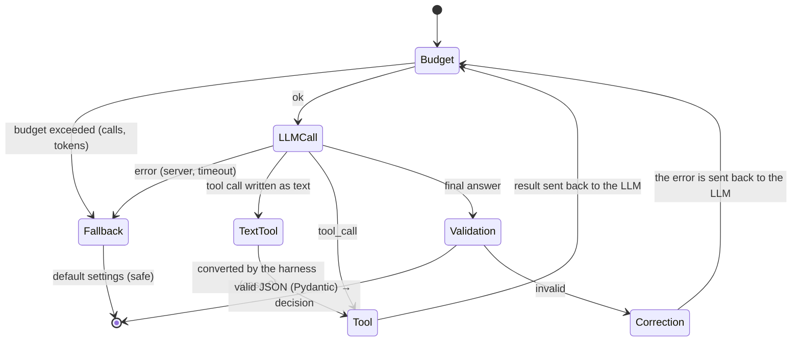

The **levers**, and why each one exists:

| Lever | Implementation | Why |
|---|---|---|
| Typed tools | `Tool(name, description, fn, args_model)` (Pydantic model of the arguments) → JSON schema sent to the LLM, arguments validated | the LLM knows what to provide; its argument errors are caught |
| Lean schema | removal of the `title` fields generated by Pydantic | fewer tokens **on every call** |
| Contractual output | `SheddingPlan`: **required** fields, unknown fields **forbidden** (`extra="forbid"`) | an answer that does not really contain a decision is **rejected** |
| Robust extraction | search for the first JSON object (raw answer, ```json block, surrounding text) | small models chatter around the JSON |
| Self-correction | the validation error is sent back to the LLM ("invalid JSON: …") | it often corrects itself on the 2nd attempt |
| **Case 0** | a tool call written **as text** (`{"name": "view_flexibility", "arguments": {}}`) is converted into a real call | real bug in Qwen 1.5 B (§16) |
| Budget | max 4 calls and 6,000 tokens per decision | an agent without a budget can loop; tokens ≈ energy |
| Domain filtering | unknown group names **ignored** and counted (`groups_unknown_ignores`) | observed hallucination: 2 invented names over 8 requests |
| Safe fallback | the optimizer's default settings | the agent can never degrade the system's safety |
| Traces | every step (content, tools, tokens, duration) recorded, visible in the interface | debugging and demonstration ("inside the agent's head") |
| Measurement | `meter.record_llm(tokens, duration, active time)` on every call | the LLM's energy is counted (§9) |

### 8.3 FakeLLM: testing the agent without an LLM

- Same interface as the Ollama client (`chat(messages, tools, json_mode)`), deterministic behavior: calls the tool,
  reads the groups from the result, returns a valid plan.
- Used for **tests** and **CI** (no Ollama on GitHub). Its energy measurements are **meaningless** → "fake" results are
  marked as not publishable everywhere.

### 8.4 Why not more LLM?

- **Latency**: ~10 s per call on CPU; 672 decisions per week × 60 homes = impossible.
- **Reliability**: a 1.5 B model forgets fields, invents names, writes its tool calls as text.
- **Energy**: 238 mWh for 8 calls, versus 0.72 mWh for **the whole** week's optimization (1,242 mWh for 18 calls with the French prompt).
- **What the LLM brings**: a natural-language interface, the ability to take qualitative instructions into account
  ("protect vulnerable people"), and an explainable trace. Useful **at the strategic level**, not in the control loop.

---

## 9. Measuring the AI's energy

### 9.1 The principle

$$E\ (\text{kWh}) = \frac{\text{CPU seconds} \times \dfrac{\text{TDP}}{\text{number of logical cores}} \times \text{PUE}}{3\,600\,000}$$

- **TDP** = 28 W (i5-1155G7), 8 logical cores, PUE = 1 (no data center).
- Same principle as **CodeCarbon** without a hardware sensor.

### 9.2 Three methods, cross-checked

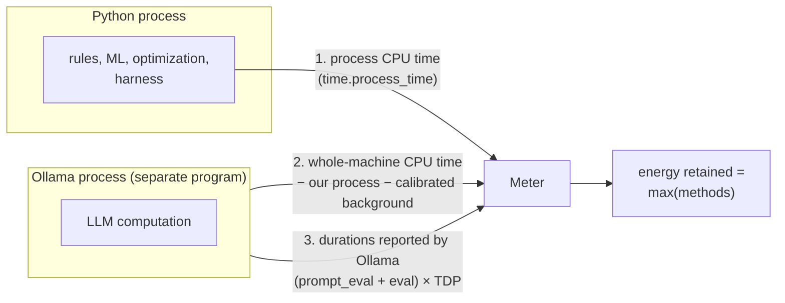

1. **CPU time of our process** (finest resolution available); for very short blocks, the max of CPU time and wall-clock
   time excluding waiting for the LLM is taken (the OS CPU clock advances in steps of 10-16 ms).
2. **Whole machine**: CPU time of the whole machine − our process − **calibrated background activity** (2 s of
   measurement at startup) → captures the LLM even if its process cannot be read.
3. **Ollama's report**: `prompt_eval_duration + eval_duration` = active compute time; × TDP (while it computes, the LLM
   uses the whole processor).

- **The maximum is retained**: methods 1 and 2 can only underestimate.
- **Buckets**: `setup` (paid once: learning), `shared` (recurring: decisions), to distinguish investment from
  operation.
- **Machine-independent indicators**: number of calls, input/output tokens, durations → anyone can redo the calculation
  with **their own** machine or a data-center factor.

### 9.3 The bug that justifies all this

On Windows, Ollama runs as a service: `psutil` gets "access denied" on its CPU time → method 1 gave **0** for the LLM,
which appeared **1,000 times cheaper** than in reality. Detected because the result was "too good to be true"; fixed by
methods 2 and 3, each validating the other (~0.07 Wh per Qwen 1.5 B call on this PC).
**Interview lesson: an LLM in another process (or in the cloud) is invisible to a naive measurement.**

### 9.4 Measured orders of magnitude (one week, 60 homes)

| Item | Energy |
|---|---|
| learning the 60 thermal models | ~0.0002 Wh |
| rules (round-robin) | ~0.03 mWh |
| AI optimizer (learning + forecasts + 64 optimizations) | **0.72 mWh** |
| LLM agent (8 calls, 40 s) | **238 mWh** (≈ 0.24 Wh) |
| for comparison: energy shed by the optimizer | ~780 kWh (i.e. ~1,000,000 kWh per Wh of AI) |

---

## 10. The assessment: indicators and formulas

| Indicator | Formula / definition | Why |
|---|---|---|
| **Delivered demand response** | Σ_t min(max(ref_t − grid_draw_t, 0), volume) × Δt, **step by step** | as RTE does: an extra step does not make up for a missed one |
| Delivery rate | delivered / requested | keeping the commitment |
| Hold rate | share of steps at ≥ 90 % of the volume | regularity |
| **Rebound** | Σ max(grid_draw − ref, 0) in the 2 h after the request | the energy that comes back |
| Over-peak | peak after the request − daily peak without demand response | creating a new peak is a failure |
| **Added discomfort** | Σ max(setpoint − tolerance − T, 0) × Δt (occupants at home, electric heating), minus the reference | the human cost |
| Service failures | cold water (missing kWh), car not charged at departure | hard constraints |
| RTE revenue | 200 €/MWh × delivered − 300 €/MWh × shortfall | payment / penalty ("TO BE CHECKED") |
| Bill savings | bill (Tempo) without demand response − with | the residents' gain |
| Wear | SOH loss × capacity × 90 €/kWh | battery health has a price |
| **Profit** | revenue + savings − wear | the "how much does it earn" |
| CO2 avoided | Σ (ref − grid_draw) × CO2 intensity of the hour | rebound and recharging included |
| AI cost | measured energy × average price; × average CO2 | the challenge's question |
| **Net AI gain** | profit(AI) − profit(best without AI) − AI cost | the answer |

**The reference curve** (ref) = the "no demand response" simulation: known exactly here, **estimated** in real life
(a topic in its own right: baseline methods based on similar days, etc.).

---

## 11. Results

Scenario: **60 homes**, 120 kWp, 4 packs of 40 kWh (SOH 71 to 78 %), Tempo tariff, **January 15-21, 2024**, **real**
weather and grid data (Open-Meteo, RTE), simulated homes and appliances. **8 requests** from RTE.

| | Cut everything | Round-robin | Prepared round-robin (best without AI) | **AI optimizer** | LLM agent |
|---|---|---|---|---|---|
| Delivered | 58 % | 64 % | 91 % | **89 %** | 87 % |
| Hold rate | 50 % | 17 % | 72 % | 64 % | 62 % |
| Rebound | 633 kWh | 488 kWh | 460 kWh | **70 kWh** | 61 kWh |
| Added discomfort | +239 °C·h | +102 °C·h | +70 °C·h | **−33 °C·h** | −37 °C·h |
| Min T of occupants at home | 15.9 °C | 16.1 °C | 16.3 °C | **16.8 °C** | 17.1 °C |
| RTE revenue | −9.67 € | 15.49 € | 134.68 € | 126.14 € | 119.83 € |
| Bill savings | 47.70 € | 19.64 € | 150.43 € | **231.41 €** | 227.26 € |
| Battery wear | 0 € | 0 € | 5.84 € | 3.51 € | 3.51 € |
| **Profit** | 38 € | 35 € | 279 € | **354 €** | 344 € |
| AI energy | ~0 | ~0 | ~0 | **0.72 mWh** | 238 mWh |
| LLM calls | 0 | 0 | 0 | 0 | 8 |
| **Net AI gain** | | | reference | **+74.76 €** | +64.30 € |

**How to read it**

1. **"Cut everything" is a counter-example**: it delivers 58 %, but everything restarts at once → 633 kWh of rebound,
   homes at 15.9 °C, and RTE penalties.
2. **A well-designed rule is already good** (91 %): honesty requires saying so. The AI does not win on volume.
3. **The AI wins on everything else**: rebound ÷ 6.5, comfort better than without demand response (preheating), bill
   (cars charged during off-peak hours), wear. **+75 € net per week** for 60 homes.
4. **Frugal AI crushes the challenge's question**: 0.72 mWh of compute for ~780 kWh shed.
5. **The LLM**: same execution mechanics, slightly worse choices (−10 €), **~330 times more energy**. Its cost in
   euros stays negligible **because it is only called 8 times**: it is the architecture (ADR-07) that makes it
   acceptable, not the model.
6. **Prompt language matters**: in the French version of this project, the same agent on the same week needed
   **18 calls (1,242 mWh)** instead of 8 (238 mWh): more malformed answers, hence more self-correction rounds and
   invented group names. Same model, same task, ~5× the energy. One run each: an observation, not a benchmark — but a
   good argument for measuring rather than assuming.

**Honesty**: the **CO2 avoided is small** (0.7 kg). Two reasons: demand response **shifts** consumption more than it
removes it, and we use the **average** intensity of the French grid (low-carbon). The real climate gain comes from
**avoided peaking plants** (**marginal** intensity, much higher): improvement lead #1.

---

## 12. Quality: tests, reproducibility, data honesty

### 12.1 Tests (pytest, 35 tests, ~10 s)

| File | What is checked (examples) |
|---|---|
| `test_weather.py` | sun at its zenith at solar noon in summer, set at night, offline fallback flagged and consistent |
| `test_solar.py` | plausible annual production (kWh/kWp), meter close to the model, AI forecast working |
| `test_batteries.py` | efficiency and SOC bounds, a worn battery is less powerful and keeps aging, the bench spares the most tired pack, the BMS corrects drift and estimates health |
| `test_usage.py` | annual consumption per type, habits recovered (k-means), consumption forecast |
| `test_appliances.py` | consistent portfolio (groups = connected and equipped), **types stable whatever the duration**, cut → T drops **then catch-up**, learning of C within ±35 % |
| `test_grid.py` | off-peak hours cheaper, red day, resale < purchase, fallback flagged |
| `test_demand_response.py` | stress days → right slots (red: morning + evening; white: evening), forced request if no stress day, declared flexibility **with batteries**, volume = 60 % |
| `test_control.py` | the optimizer charges when cheap and discharges when expensive, all rules simulate, agent with FakeLLM |
| `test_aggregator.py` | all 6 strategies run, cars charged and hot water available, **optimizer better than round-robin** (delivered, comfort, rebound), agent: JSON contract respected |
| `test_assessment.py` | **energy conservation** (production + purchase = consumption + resale + storage), the battery improves self-sufficiency, sizing, writing of results |

- Tests run **offline** (synthetic data, FakeLLM) → identical everywhere.
- **GitHub Actions CI**: Ubuntu **and** Windows, Python 3.12, on every push.

### 12.2 Reproducibility

- **Fixed seeds** everywhere (`seed=42` in the scenario, derived seeds per sub-module).
- **Download cache** (`data/cache/*.csv`) → same data on the next run, even without internet.
- **Centralized assumptions** in `config.py`: changing an assumption = changing one line.
- **Complete results** in JSON (`results/demand_response.json`): time series, indicators, agent traces.

### 12.3 Data honesty (non-negotiable)

- Every result displays its **sources**; any fallback source is marked **SYNTHETIC**.
- Every uncertain value is marked **"TO BE CHECKED"** in `config.py`.
- Results with FakeLLM: "costs not real" warning.
- "FORCED" request (no stress day): flagged.

---

## 13. Interfaces: CLI, Streamlit, video

### 13.1 The `quartier` command line

| Command | Role |
|---|---|
| `quartier check` | checks libraries, access to Open-Meteo / RTE, Ollama |
| `quartier demo <module>` | demo of one module: text + PNG in `results/` |
| `quartier flex [--llm ollama]` | **the demand-response assessment**: all strategies + net balance |
| `quartier run` | self-consumption control (previous project) |
| `quartier size` | panels × batteries sweep |
| `quartier interface` | Streamlit interface |
| `quartier video` | automatic demo video + conclusion slide |

Common options: `--start --days --homes --kwc --packs --tariff --offline --model`.

### 13.2 The Streamlit interface

- **Home** + **11 pages** (one per module), menu generated by Streamlit from the numbered file names.
- **Shared scenario** in the sidebar (`st.session_state`): period, homes, kWp, packs, average SOH, tariff, offline.
- Each page: **what the module does** (teaching text), a button that runs the demo, the results (sentences, charts,
  tables), and "how to test this module on its own".
- Page **11 · Assessment**: choice of LLM (fake / Ollama), comparison table, net balance, curves, **agent traces**.
- **Browser-free testing**: a fake `streamlit` module made it possible to run every page in local CI (all buttons
  "clicked") to catch errors.

### 13.3 The automatic video (`video.py`)

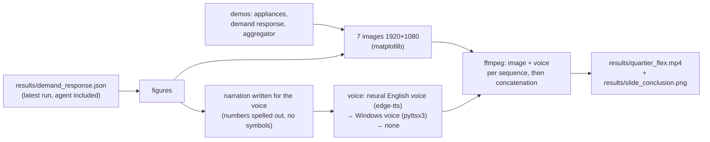

- The **video's figures come from the latest real assessment**: the video and the results cannot get out of sync.
- Cascading fallback for the voice; subtitles burned in in every case.

---

## 14. Limitations and risks

| Limitation | Effect on the conclusions | How to lift it |
|---|---|---|
| **Simulated** homes, appliances and behaviors | the euros depend on the assumptions | aggregated Linky smart-meter data (Enedis open data), panel from a real aggregator, CEREN survey |
| **Approximated** Tempo colors | a few days may be misclassified | official calendar published by RTE |
| **Flat-rate** payment of 200 €/MWh and penalty of 300 €/MWh | RTE profit is indicative | NEBEF rules / balancing mechanism, real prices |
| **Average** CO2 (not marginal) | strongly underestimates the climate gain | marginal intensity (peaking plants) |
| **Known** reference curve (simulator truth) | delivered demand response is "perfectly measured" | realistic baseline method (similar days): would add an error |
| 1R1C: no heat pumps, no rooms | order of magnitude, not precision | COP model for heat pumps, 2R2C |
| No distribution network | no local constraints (transformer) | add a power constraint at the substation |
| Compute energy via **TDP** | order of magnitude (±50 %) | power meter, RAPL on Linux |
| One week, one site, one seed | variability not quantified | sweep of periods and seeds, confidence intervals |
| 1.5 B LLM | the LLM is at a disadvantage | test 3 B / 7 B (slower, more costly: the conclusion probably gets stronger on the energy side) |
| Preheating: bump at 5 pm | small peak before the peak | gradual preheating, costed in the optimization |

**Risk of over-interpretation**: the robust conclusion is not "+75 €", it is the **ranking**:
naive rule ≪ prepared rule < frugal optimizer ≈ strategic LLM, and **the energy cost of frugal AI is negligible
compared with what it earns; the LLM's is negligible only because it is called rarely**.

---

## 15. Scaling up: from prototype to product

### 15.1 Target architecture (if this were a real aggregator)

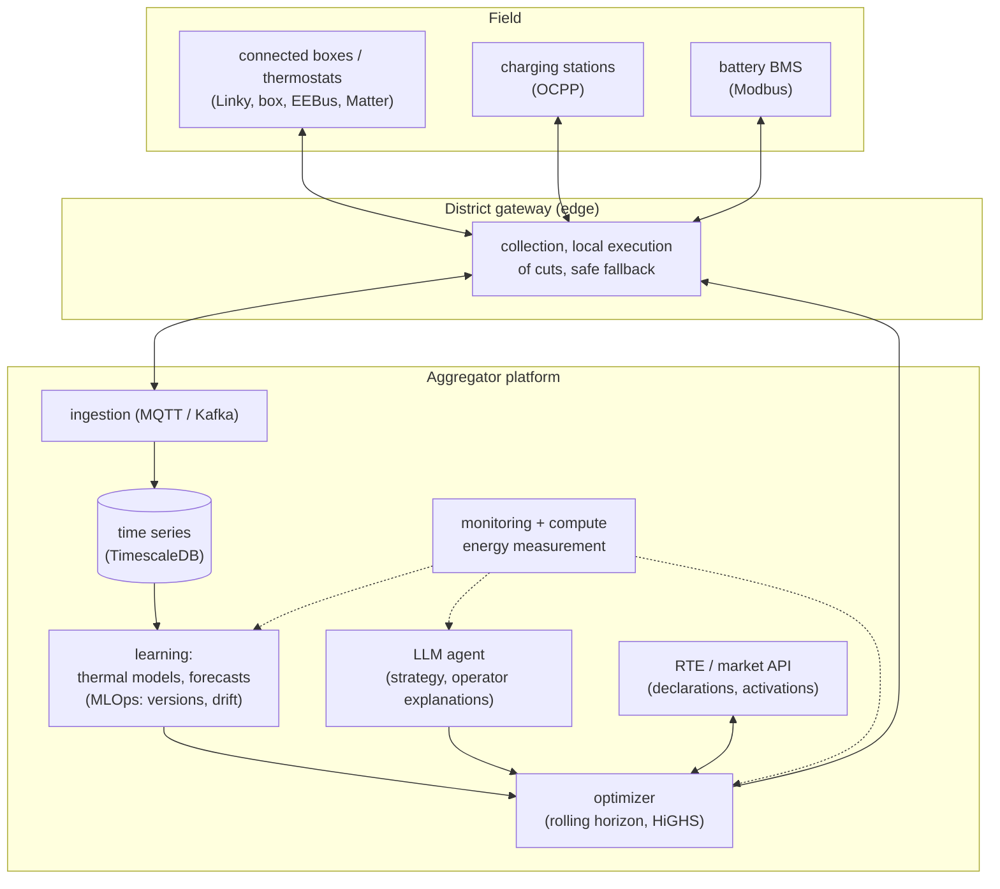

### 15.2 What changes at scale

- **Volume**: 100,000 homes → array-based simulation holds up (NumPy), optimization stays at the **group** level
  (a few dozen variables), selecting homes within a group is a sort → **linear in N**.
- **Real time**: decisions every 15 min → comfortable compute budget; local (edge) execution guarantees a **safe
  fallback** if the link is lost (never cut without a valid, recent order).
- **Continuous learning**: re-identify UA/C every week; **detect drift** (insulation work, new heater).
- **Reference curve**: the real industrial issue (certifiable by RTE): shadow homes are a physics-based version of it,
  to be compared with statistical methods.
- **Security**: controlling equipment in private homes → strong authentication of orders, logging, hard limits in the
  box (30 min max hard-coded on the field side).
- **Privacy**: learn as close to the source as possible (edge), only send up aggregates (a principle already applied in
  the prototype: RTE only receives groups).
- **Compute frugality**: keep energy measurement in production (dashboard), per-decision budget for the LLM.

### 15.3 "Deployable elsewhere" reuse

- Change city: `Site(lat, lon)`; portfolio: `AppliancesConfig`; tariff: `TariffConfig`; size: `--homes`.
- Everything is open data / open source; no API key.

---

## 16. Project history: the bugs that taught something

Three projects in 48 h, each reusing the previous one:

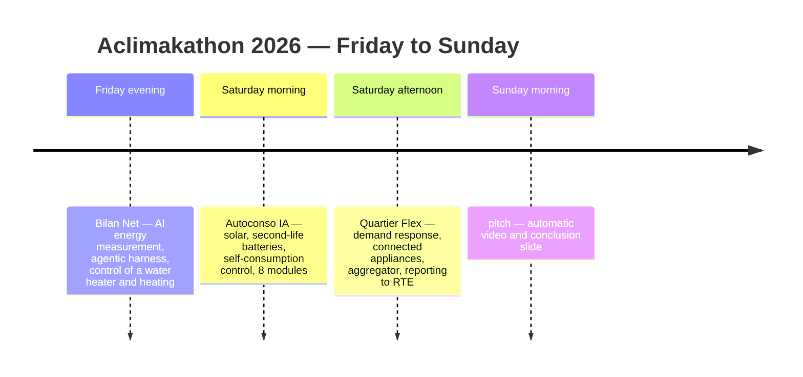

| # | Symptom | Cause | Fix | Lesson |
|---|---|---|---|---|
| 1 | The LLM looks 1,000× cheaper than expected | Windows refuses to read the CPU of the Ollama service | whole-machine measurement + durations reported by Ollama | **compute in another process is invisible** to a naive measurement |
| 2 | The optimizer behaves exactly like the rule in winter | power bounds = **instantaneous** margin (0 when the battery is empty) over the whole horizon | nominal bounds | model what will be possible, not only what is possible now |
| 3 | The optimizer never discharges | rolling-horizon "procrastination" (equal prices → always later) | slight discounting (0.2 %/h) | problems with multiple solutions behave badly in a loop |
| 4 | The battery never empties / empties too early | badly calibrated terminal value of energy | minimum price × efficiency − wear | the end of the horizon is an economic assumption |
| 5 | The LLM agent "decides"… to do nothing | Qwen writes the tool call **as text**; output with default values passed validation | harness case 0 + output **without default values**, unknown fields forbidden | **an output contract that is too permissive accepts anything** |
| 6 | Free battery at the start | initial SOC of 50 % counted as free | start at minimum SOC | initial conditions bias comparisons |
| 7 | Almost zero demand response with the first thermal model | "ideal" thermostat that catches up on everything in 15 min | proportional control (1 h 30) | the result depends on how realistic the **controller** is, not only the building |
| 8 | Heating forecast with 40 % error | "holding power" ignores restarts | simulate the learned model | forecasting a dynamic system = **simulating** it |
| 9 | Round-robin misses the volume | heaters switched back on catch up during the request | shadow homes (optimizer) | this is the **reference curve** problem |
| 10 | The optimizer "sheds" cars that are already charged | reference = current demand of the cut cars | shadow car (would already have finished) | same lesson, on another appliance |
| 11 | The optimizer does not recharge the battery before the request | recharge size computed with the **available** power of an empty battery (0) | nominal power | same bug as #2, elsewhere: a recurring pattern |
| 12 | EV charging → new peak at 10 pm | all postponed to the start of off-peak hours | spread over the night | moving a peak creates another one unless you smooth it |
| 13 | A home changes type depending on the page | type draws mixed with consumption draws | separate random generators | reproducibility has to be designed |
| 14 | Preheating "cheats" | it used the **actual** future presence | **scheduled** presence | strictly separate truth from available information |

---

## 17. Interview questions and answers

**Q. In one sentence, what did you build?**
A digital twin of a district that compares electricity demand-response strategies (rules, optimization, an LLM agent)
while also measuring the energy consumed by the AI itself.

**Q. Why is demand response decided at the district level and not per home?**
On the regulatory side, RTE contracts with aggregators. Statistically, aggregation smooths things out: a district is
predictable (12 % error) whereas a single home is not (21 %). In terms of power, one heater weighs nothing. So we
contract at the district level, decide per group (occupant type × appliance), and execute at the home level.

**Q. Why no deep learning?**
Little data per home, the need to extrapolate to situations never seen before (a cut), the need for explainability,
and the challenge itself is about frugality. A two-parameter physical model learned by regression forecasts within
12 % at the district level for a few milliseconds of compute.

**Q. Why linear optimization?**
The problem is naturally linear (energy balances, capacities, proportional costs), the solution is optimal and the
constraints are guaranteed, in milliseconds. Reinforcement learning would need long training, with no guarantee of
respecting the constraints.

**Q. What is "harness engineering"?**
Everything around an LLM that makes it reliable: typed tools, a validated output contract, self-correction, a budget,
a safe fallback, traces, measurement. Two real bugs from a small model were fixed in the harness, not in the prompt.

**Q. So the LLM is useless?**
It is useful at the strategic level (one decision the day before, qualitative instructions, a readable explanation),
not in the control loop. Measured: about 330 times more energy than the optimizer for a slightly worse result; acceptable
only because it is called 8 times a week. That is an architecture decision, not a model decision.

**Q. How did you measure the LLM's energy?**
CPU time × TDP per core, with three methods (our own process, the whole machine minus background noise, durations
reported by Ollama), keeping the maximum. I discovered that the naive measurement underestimated by a factor of 1,000
because the Ollama process could not be read on Windows.

**Q. How do you know the AI isn't cheating?**
Strict separation between truth and available information: noisy temperatures, learned parameters, scheduled rather
than actual presence, forecast rather than observed weather; the comfort rule is enforced by the simulator; the same
request for every strategy.

**Q. Is your best result robust?**
The ranking is (tested in CI: the optimizer beats round-robin on delivery, comfort and rebound). The euro figures
depend on assumptions marked "TO BE CHECKED". Several periods and seeds would be needed for confidence intervals.

**Q. What would you do with one more month?**
Marginal CO2; a real statistical reference curve; the official Tempo calendar; heat pumps; several weeks and seeds; a
bigger LLM to check that the conclusion holds.

**Q. What was the hardest part?**
The rebound: understanding that cutting a heater **shifts** the energy (88 % comes back), and that the whole challenge
is measuring what would have been consumed without the cut, hence the shadow homes.

**Q. How did you work with a team of non-developers?**
A modular architecture that can be tested one module at a time, one doc sheet and one interface page per module, and
all assumptions in a single commented file marked "TO BE CHECKED": the non-developers checked the numbers (tariffs,
equipment shares, SOH), not the code.

**Q. Did you use an AI assistant to write the code?**
Recommended answer: **yes, and say so**. "I designed the architecture, made the choices, validated the results and
diagnosed the bugs; I used a coding assistant to move fast on the implementation, within 48 hours." It is credible,
honest, and a sought-after skill, as long as you can explain every choice, which this document lets you do.

---

## 18. Glossary

| Term | Definition |
|---|---|
| **Demand response** (effacement) | voluntary reduction of consumption at the grid's request |
| **Aggregator** / demand-response operator (opérateur d'effacement) | company that pools many flexible sites and sells their flexibility |
| **RTE** | French electricity transmission system operator |
| **EcoWatt** | RTE signal indicating grid stress (green/orange/red) |
| **Tempo** | French time-of-use tariff with 3 day colors (blue, white, red); red days are very expensive during peak hours |
| **NEBEF** | French mechanism for selling demand-response volumes on the energy markets |
| **Rebound** | over-consumption after a demand-response event (the shifted energy comes back) |
| **Aggregation effect** (foisonnement) | individual variations cancel each other out when aggregated |
| **Reference curve** (baseline) | what a site would have consumed without demand response |
| **1R1C** | thermal model with one resistance (insulation) and one capacitance (thermal inertia) |
| **UA** | heat-loss coefficient (kW per °C of temperature difference) |
| **System identification** | learning the parameters of a physical model from measurements |
| **SOC / SOH** | state of charge / state of health of a battery |
| **EFC** | equivalent full cycle |
| **BMS** | battery management system (measurement, estimation, protection) |
| **OCV** | open-circuit voltage, linked to SOC |
| **Second life** | stationary reuse of an electric-vehicle battery (SOH ~70-80 % → 60 %) |
| **kWp** (kWc in French) | peak power of a solar installation |
| **MPC** / model predictive control | optimize over a horizon, apply the first step, repeat |
| **Linear programming** | optimization of a linear objective under linear constraints |
| **HiGHS** | open-source linear programming solver (used by SciPy) |
| **Gradient boosting** | ensemble of decision trees learned one after another |
| **k-means** | unsupervised clustering into k groups |
| **ARI** | adjusted Rand index: agreement between two partitions (1 = perfect) |
| **nMAE** | mean absolute error normalized by the mean |
| **Harness** | the infrastructure around an LLM: tools, validation, budget, fallback, traces |
| **Tool calling** | the LLM requests the execution of a function described by a schema |
| **TDP** | thermal design power of a processor (proxy for its power draw under load) |
| **Ollama** | local server that runs open-source LLMs |
| **FakeLLM** | deterministic fake LLM for testing without a model |

---

*Architecture document for Quartier Flex — Aclimakathon 2026. All values marked "TO BE CHECKED" in `config.py` are orders of magnitude to be confirmed before publishing figures.*
