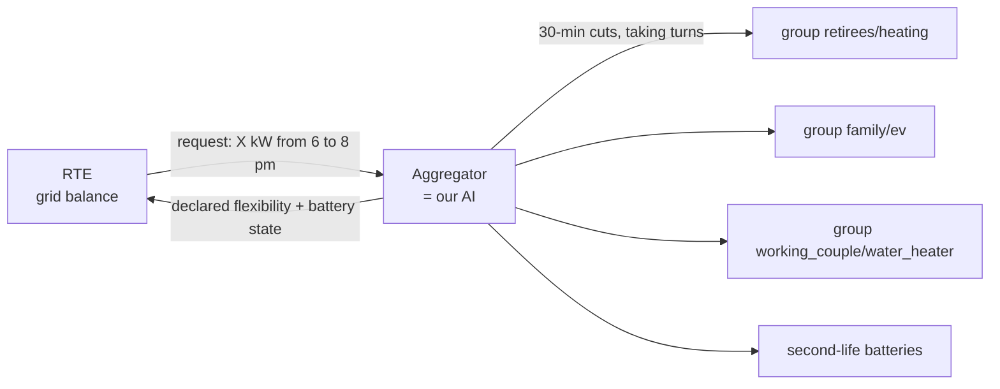

# Module 7 — Demand response: what RTE asks, what the district declares

**Role**: produce RTE's **demand-response requests**, and the **declared flexibility** of the district (batteries included).

## Demand response at the home level or the district level?

**The district.** In real life, RTE never controls a single home:



- RTE (the French transmission system operator) activates a **demand-response operator** (aggregator) for a **volume** over a **slot**.
- The aggregator shares this volume between **sheddable groups** (occupant type × appliance) and batteries.
- A single home is too small and too unpredictable; a district is predictable (**diversity**, module 5).

## The requests (`signals.py`)

- **Stress day** = a **white or red** Tempo weekday (color approximated from RTE's national consumption).
- Slots: **6–8 pm** on stress days, + **7–9 am** on red days (winter peaks, cf. EcoWatt).
- Announcement: **the day before at 5 pm**.
- No stress day in the period → a request is simulated on the most loaded day (this is flagged).

## The reporting (`reporting.py`)

The day before, the district declares, **for each slot**:

- per **group**: forecast kW (learned model, module 5) and **sheddable** kW (heating: half, because of the
  30 min off / 30 min on rotation; water heater and car: all of it);
- the **batteries**: SOC, SOH, real capacity, max power (reduced if the battery is worn) → kW they can hold
  over the slot **if they are recharged beforehand**.

RTE then requests **60 %** of the declared flexibility (`DemandResponseConfig.share_of_flex`).
The request is **the same for all strategies** (fair comparison).

## Test

```powershell
quartier demo demand_response
pytest tests/test_demand_response.py -v
```

## For the team to check

- Payment (200 €/MWh) and penalty (300 €/MWh): orders of magnitude, to be compared with RTE's NEBEF mechanism /
  balancing mechanism.
- The actual Tempo colors published by RTE for the period (instead of the approximation).
